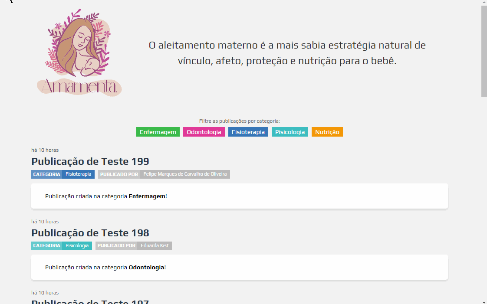
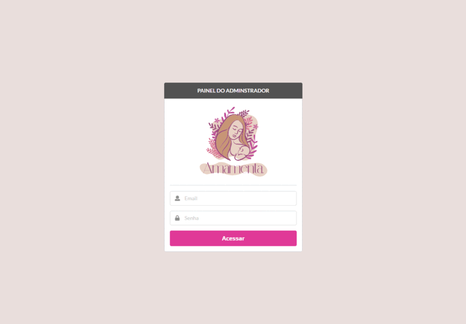

# ✨ amamentaufn

Este repositório contem a minha contribuição para o Projeto Amamenta ([Laboratório Avançado de Produtos do Mestrado em Saúde Materno Infantil](https://matinf.lapinf.ufn.edu.br/)) onde fui encarregado de desenvolver o blog que serve para que os demais contribuintes possuam um ambiente para a publicação e gerenciamento de artigos como objetivo de auxiliar às mães na orientação das melhores práticas de amamentação. Além do blog um painel foi desenvolvido para que os responsáveis do projeto possam gerenciar os recursos da aplicação.

<p align='center'>


</p>

<p align='center'>
  
  
</p>

# Rodando a Aplicação

Para iniciar o projeto, clone o repositório:

```bash
git clone https://github.com/felipemcoliveira/amamentaufn.git
```

Entre no diretório do repositório local:

```bash
cd amamentaufn
```

Instale as dependência do projeto:

```bash
npm install
```

Gere a build de todos os workspaces:

```bash
# um erro sera causado pelo workspace client/core por conta
# da ausência de um script de build, basta ignora-ló
npm run build --workspaces
```

Entre no diretório do servidor:

```bash
cd server
```

Crie o arquivo `.env` na raíz do projeto:

```bash
# suporta outros arquivos como .env.production e .env.development
touch .env
```

Defina as seguintes variavéis de ambientes no arquivo criado:

```bash
# ----------------------------------------------------------------------------
# Servidor
# ----------------------------------------------------------------------------

# porta onde o servidor vai aguardar requisições
HTTP_PORT=

# ----------------------------------------------------------------------------
# Banco de dados
# ----------------------------------------------------------------------------

# host do banco de dados
DATABASE_HOST=
# usuário do banco de dados
DATABASE_USER=
# senha do usuário do banco
DATABASE_PASSWORD=
# porta do banco de dados
DATABASE_PORT=
# nome do banco de dados criado para a aplicação
DATABASE_NAME=

# ----------------------------------------------------------------------------
# Json Web Token (JWT)
# ----------------------------------------------------------------------------

# deve ter pelo menos 32 carctérios. quanto maior melhor, melhor
JWT_SECRET=
# tempo em segundos para o jwt expirar
JWT_EXPIRESIN=
```

Sincronize o banco de dados, este comando deve criar todas as tabelas no banco e criar as permissões necessária para o sistema funcionar. Por conta do prazo de entrega e por se tratar de um banco com previsões de alteração, não foi utilizado migrations e seeders (me perdoem devs 😔):

```bash
node dist/main-cli db:sync
```

Crie um usuário para gerenciar o sistema:

```bash
# com apenas a permissão de CAN_MANAGE_PERMISSIONS o usuário já é capaz de adicionar as demais
node dist/main-cli user:create <email> <password> <firstName> <lastName> --permissions "CAN_MANAGE_USERS, CAN_MANAGE_PERMISSIONS"
```

Inicialize o servidor:

```bash
node dist/main.js
```

Pronto! A aplicação estará aguardando por requisições na porta definida.
